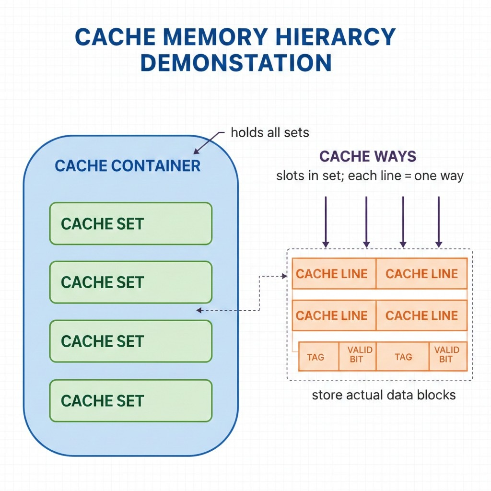

## cpu-cache-simulator

## ⚠️ project in progress ...

Simulates CPU cache Layers hierarchy;
analyze memory access performance; Tracks hits, misses, and eviction counts for L1, L2, and L3 caches
Useful for understanding CPU-memory interactions and optimizing software/data placement.

